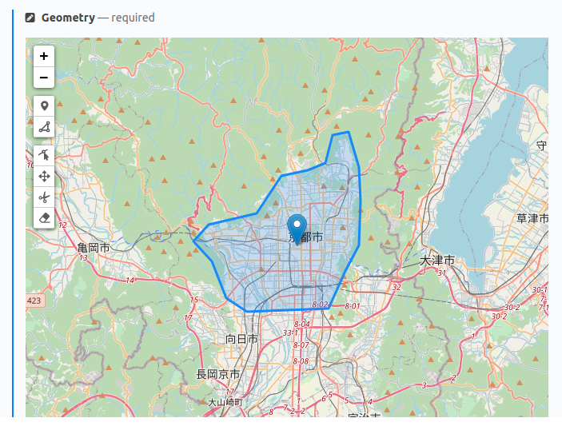

# Cockpit CMS GeoJSON Field

Add-on for [Cockpit CMS](https://getcockpit.com/) to add GeoJSON field types.
Editing powered by [Leaflet](https://leafletjs.com/) and [Leaflet-Geoman](https://github.com/geoman-io/leaflet-geoman).



## Installation

From your Cockpit CMS installation's root folder:

```bash
git clone git@github.com:eshu-connect/CockpitGeoJSON.git addons/GeoJSON
```

## Configuration

| Field | Description |
| -- | -- |
| controls | Toolbar controls settings. Supports all [geoman](https://github.com/geoman-io/leaflet-geoman#leaflet-geoman-toolbar) settings. |
| global | Global geoman editor settings. Supports all [geoman](https://github.com/geoman-io/leaflet-geoman#options) options.

Example:

```json
{
  "controls": {
    "position": "topleft",
    "drawCircle": false,
    "drawCircleMarker": false,
    "drawRectangle": false,
    "drawPolyline": false
  },
  "global": {
    "snapDistance": 20,
    "snappable": true,
    "allowSelfIntersection": false
  }
}
```

## Data Format

At the moment, only GeoJSON `FeatureCollection` is supported.
There is not yet any functionality to limit the amount of features in the collection.

When querying the API, you will get the field's data as standard GeoJSON:

```json
{
  "fields": {
    "geometry": {
      "name": "geometry",
      "type": "geojson",
      "localize": false,
      "options": {
        "controls": {
          "position": "topleft",
          "drawCircle": false,
          "drawCircleMarker": false,
          "drawRectangle": false,
          "drawPolyline": false
        },
        "global": {
          "snapDistance": 20,
          "snappable": true,
          "allowSelfIntersection": false
        }
      }
    }
  },
  "entries": [
    {
      "_mby": "5efda3a0d8167240d716c331",
      "_by": "5efda3a0d8167240d716c331",
      "_modified": 1593787782,
      "_created": 1593681824,
      "_id": "5efda7a0096f3278d33b0771",
      "geometry": {
        "type": "FeatureCollection",
        "features": [
          {
            "type": "Feature",
            "properties": [],
            "geometry": {
              "type": "Polygon",
              "coordinates": [
                [
                  [
                    139.59709,
                    35.660643
                  ],
                  [
                    139.570309,
                    35.629396
                  ],
                  [
                    139.604643,
                    35.587807
                  ],
                  [
                    139.682926,
                    35.606511
                  ],
                  [
                    139.689105,
                    35.641394
                  ],
                  [
                    139.657864,
                    35.65869
                  ],
                  [
                    139.59709,
                    35.660643
                  ]
                ]
              ]
            }
          }
        ]
      }
    }
  ],
  "total": 1
}
```